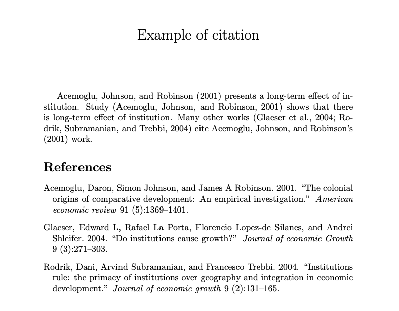

```{r setup, include=FALSE}
knitr::opts_chunk$set(echo = TRUE)
```

This article shows you how to cite papers with biblatex in Overleaf.

### Example

The overall code is:

```s
\documentclass{article}
\usepackage[utf8]{inputenc}
\usepackage{natbib}

\title{Example of citation}
\date{}

\maketitle
\begin{document}
\cite{acemoglu2001colonial} presents a long-term effect of institution. 
Study \citep{acemoglu2001colonial} shows that there is long-term effect of institution. 
Many other works \citep{glaeser2004institutions, rodrik2004institutions} cited \citeauthor{acemoglu2001colonial}'s (\citeyear{acemoglu2001colonial}) work.

\bibliographystyle{jpe}
\bibliography{example}
\end{document}
```

which compiles

 

### Steps
1. In your Overleaf project, create a new file, name it as example.bib
2. Find the papers on Google Scholar and click *Cite*, at the bottom of the page, click *BibTex*, and copy the text. The text has the following format:
```s
@article{key,
  title={Title},
  author={Author},
  journal={Journal},
  volume={vol},
  number={number},
  pages={pp},
  year={year}
}
```
3. Go back to Overleaf, paste the text in example.bib, change the **key** of the cited article if you want.
4. In your *main.tex*, before `\begin{document}`, type `\usepackage{natbib}`
5. At the end of the document, include
```s
\bibliographystyle{jpe}  % the natbib style you use, apa, jpe, etc.
\bibliography{example}   % include the bib file you created
```
6. In the body of your document, you could use `\cite{key}`, `\citep{key}`, etc. to cite papers now.
7. Further reading: [Natbib citation styles](https://www.overleaf.com/learn/latex/Natbib_citation_styles)

---
Originally publish in Chinese at [简书](https://www.jianshu.com/p/71ad2e74b7c0) on Apr. 20, 2021.