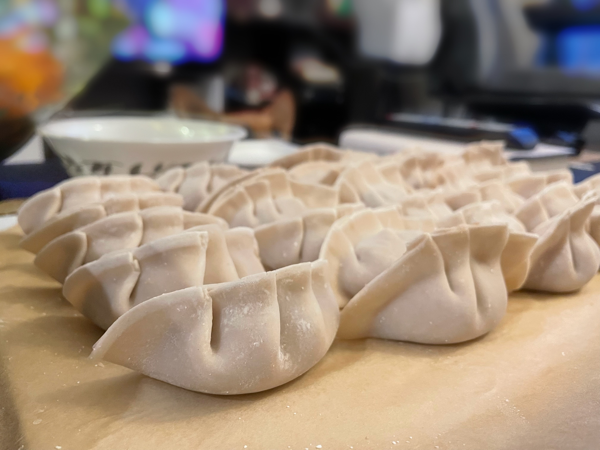

```{r setup, include=FALSE}
knitr::opts_chunk$set(echo = TRUE)
```

<style>
  h1.title {
    display: none;
  }
  .column-left {
    float: left;
    width: 65%;
    text-align: left;
  }
  .column-right {
    float: right;
    width: 30%;
    text-align: right;
  }
</style>


## Blog

I am passionate about data and I enjoy learning new programming languages and new things. Here I share some of my learning experiences.

- [Overleaf: How to Cite Papers Using *et al.* Style](overleaf_et_al_citation.html)
- [Introduction to Git for Economist](https://xiao-ying-liu.github.io/intro_to_git/)
- [Overleaf: How to Cite Papers with Biblatex](overleaf_citation.html)

&nbsp;

## More About Me

I enjoy cooking, baking, workout, playing badminton, and reading.

 
 
 
 

