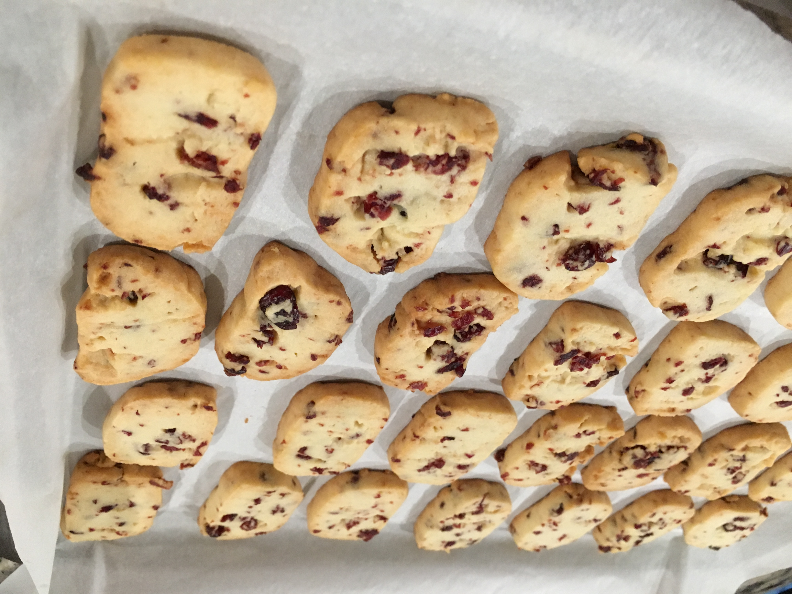

```{r setup, include=FALSE}
knitr::opts_chunk$set(echo = TRUE)
```

## Blog

I am passionate about data and I enjoy learning new programming languages and new things. Here I share some of my learning experiences.

- 01/28/2023 [Overleaf: How to Cite Papers Using *et al.* Style](overleaf_et_al_citation.html)
- 09/12/2022 [Introduction to Git for Economist](https://xiao-ying-liu.github.io/intro_to_git/)
- 04/20/2021 [Overleaf: How to Cite Papers with Biblatex](overleaf_citation.html)

&nbsp;

## More About Me

I enjoy cooking, baking, workout, playing badminton, playing tennis, and reading.

 
 
 
 

